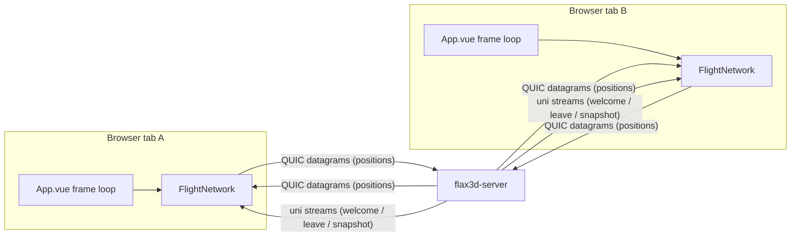
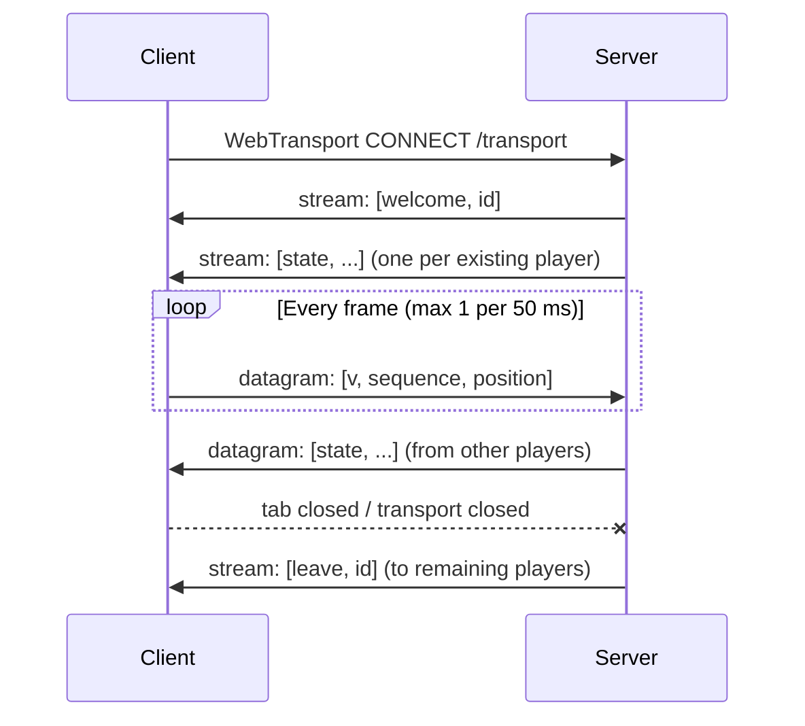

# Client–Server Behaviour

This document describes the multiplayer wire protocol and the runtime behaviour of the WebTransport
link between the Vue client (`src/network.ts`) and the Rust server (`server/src/main.rs`).

Related reading: [README.md](README.md) covers local and VPS deployment.

## Topology



The server owns a single shared `Room`. It relays position updates between clients and never runs
physics or scoring itself — the first release is visual shared flight only. Birds and tanks share
that one room: the relay never inspects `kind`, so a bird and a tank can see and shoot each other.

## Connection lifecycle



1. The client opens a WebTransport session to `/transport`.
2. The server assigns a monotonically increasing `id` (starting at 1) and sends a `welcome` message
   on its own unidirectional stream.
3. The server sends a snapshot of every existing player as individual `state` messages on separate
   unidirectional streams.
4. The client begins sending position updates as datagrams and consuming relayed datagrams.
5. When the session ends, the server's `PlayerGuard` drops, removes the player from the room, and
   broadcasts `leave` to everyone else on a unidirectional stream.

If the room already holds `MAX_PLAYERS` (32), the connection is rejected before any stream is opened.

## Endpoints and certificate trust

| Mode | WebTransport URL | Certificate trust |
| --- | --- | --- |
| Dev (`vite dev`) | `https://127.0.0.1:8698/transport` | Self-signed cert; client fetches its SHA-256 via Vite proxy `/local-certificate-hash` → `http://127.0.0.1:8699/certificate-hash` and passes `serverCertificateHashes` |
| Production | `https://<hostname>:<port or 443>/transport` | Real ACME certificate issued by the server (Certon HTTP-01) |

In dev the server binds TCP/UDP 8698 for WebTransport and TCP 8699 for the certificate-hash
metadata. In production, TCP 80 handles the ACME challenge, TCP 443 serves the site, and UDP 443
carries HTTP/3 WebTransport.

## Wire format

Messages are **MessagePack arrays** (`@msgpack/msgpack` in the browser, `rmp-serde` on the server).
Arrays are positional, so field names never travel on the wire. Every float is scaled to a
fixed-point integer first, because MessagePack encodes a JS number as 8 bytes but a small integer as
1–5. The units table below is the contract between the two implementations; both sides must agree
exactly.

| Value | Unit | Scale | Wire type | Range |
| --- | --- | --- | --- | --- |
| `x`, `y`, `z` | centimetres | ×100 | `i32` | `±45000` |
| `yaw` | milliradians, wrapped to `[-π, π)` | ×1000 | `i16` | `±4000` |
| `kind` | vehicle kind (`0` bird, `1` tank) | — | `u8` | `0..=1` |
| `bank` | milliradians | ×1000 | `i16` | `±1000` |
| `speed` | centimetres/second, **signed** so a tank can reverse | ×100 | `i16` | `-2000..=10000` |
| `spread` | milli-units | ×1000 | `u16` | `0..=1000` |
| `flap`, `flying`, `fire` | boolean | — | bool | — |
| `wingLeft`, `wingRight` | milliradians | ×1000 | `i16` | `±2000` |
| `turretYaw` | milliradians, relative to the hull | ×1000 | `i16` | `±4000` |
| `turretPitch` | milliradians, signed (negative depresses the barrel) | ×1000 | `i16` | `-1000..=2000` |
| `hullPitch`, `hullRoll` | milliradians, hull slope | ×1000 | `i16` | `±2000` |
| `health` | hit points | ×1 | `u8` | `0..=100` |

One shape carries both vehicle kinds, so the relay stays a single code path: `kind` says which code
reads the payload, and the fields a kind does not use are simply zero. A bird zeroes the four tank
fields; a tank zeroes `bank`, `spread`, `flap`, `flying` and the two wing angles.

### Client → server: `Update`

```text
[ 6, sequence, [ x, y, z, yaw, kind, bank, speed, flying, spread, flap, wingLeft, wingRight, turretYaw, turretPitch, hullPitch, hullRoll, fire, health ] ]
```

- The array is positional, so the order above is the contract with `Position` in
  `server/src/main.rs`. Both fixtures (`FIXTURE` in `src/__tests__/network.spec.ts` and
  `decodes_a_client_update_fixture` in the Rust tests) pin it; a tank fixture pins the kind-1 case.
- `kind` selects which vehicle the sender is driving. It is relayed verbatim, so every peer draws the
  right avatar and reads the right fields without any per-kind message.

- `sequence` is a per-connection counter incremented on every send.
- `yaw` is wrapped with `atan2(sin, cos)` before scaling. The local yaw grows without bound, so
  wrapping keeps the `i16` field precise and makes remote interpolation a plain shortest-arc lerp.
- `wingLeft` / `wingRight` are the per-side shoulder angles taken from the same values the local
  avatar renders with (pose-driven when the camera is tracking, otherwise the flap beat). Sending
  both lets remote players see asymmetric flapping as well as spread.
- `fire` is true while the sender holds the trigger. It is **not** bullet state: peers only use it to
  play a cosmetic shot from their own copy of the sender's gun, so bullets, drop and impacts stay
  local and nothing extra is simulated on the server. A tap lasts a single frame but updates are
  unreliable and only sent at 20 Hz, so the client repeats the flag over the next three updates
  (~100 ms, just under the 110 ms fire interval) — enough to survive a lost datagram while still
  producing exactly one shot. Holding the trigger keeps it true and each client throttles its own
  shots with the fire interval.
- `health` is the sender's own hit points, clamped to `0..=100`. Only the owning client writes it; a
  value of zero means the sender is a wreck and cannot be hit again until it respawns.
- Sent via `encodeUpdate` at most once every 50 ms (20 Hz).

### Client → server: `Hit`

```text
[ 0, victim ]
```

- Sent when one of this client's rounds strikes another bird. The tag `0` cannot collide with an
  update, whose first field is the version, and the two shapes are disjoint (two fields vs three),
  so the server decodes an update first and falls back to a hit report.
- The report names only the victim: the shooter never sends a health value, so a client can never
  dictate anyone else's health directly. The server stamps the shooter id and drops reports where
  the victim is the sender, is not in the room, or when the sender is reporting faster than 25 ms.

### Client → server: `Ping`

```text
[ 1, nonce ]
```

- Sent about once per second so the client can display a round-trip latency in the HUD.
- The tag `1` cannot collide with an update (whose first field is the version `5`) or a hit report
  (tag `0`): the server tries `Update` first and then reads the two-field form, dispatching on tag.
- The server keeps no timing state. It echoes the nonce straight back as a `pong`, so the client
  measures the whole round trip with its own clock. A server that predates the probe simply never
  replies and the HUD shows `-- ms`.

### Client → server: `Pickup`

```text
[ 2, slot ]
```

- Sent when the local bird flies within its pickup radius (4 m) of a power-up. The report is a
  *claim*, not a grant: the client never credits itself ammo. Ammo is owner-local like `health`, so
  the only thing worth arbitrating is which player won a contested slot.
- The server accepts the claim only while the slot is still active and the sender's last known
  position is within 800 cm of it — generous enough to absorb a 20 Hz position update during a fast
  pass, tight enough that a client cannot collect a power-up it is nowhere near.
- The first valid claim wins; later reports for the same slot arrive after it is already inactive and
  are ignored, so two players racing for one pickup cannot both be paid.
- The tag `2` cannot collide with an update (whose first field is the version `5`), a hit report
  (`0`) or a ping (`1`): the same two-field fallback decode reads them all and dispatches on tag.

### Server → client: `Event`

Tagged by a leading integer:

```text
welcome:       [ 0, id ]
state:         [ 1, id, sequence, [ ...same 13 position values... ] ]
leave:         [ 2, id ]
hit:           [ 3, shooter, victim ]
pong:          [ 4, nonce ]
powerup_spawn: [ 5, slot, x, y, z ]
powerup_taken: [ 6, slot, taker ]
```

`powerup_spawn` carries world centimetres, matching the position table. `powerup_taken` names the
slot and the player that collected it, so the taker can credit its own magazine while every other
client simply clears the pickup from the field.

## Transport mapping

| Message | Transport | Reliability |
| --- | --- | --- |
| `Update` (positions) | QUIC datagram | Unreliable, unordered |
| `state` relay (positions) | QUIC datagram | Unreliable, unordered |
| `Hit` (hit report) | QUIC datagram | Unreliable, unordered |
| `hit` relay | Unidirectional stream | Reliable, ordered |
| `Pickup` (pickup claim) | QUIC datagram | Unreliable, unordered |
| `powerup_spawn` | Unidirectional stream | Reliable, ordered |
| `powerup_taken` | Unidirectional stream | Reliable, ordered |
| `Ping` (latency probe) | QUIC datagram | Unreliable, unordered |
| `pong` (latency echo) | QUIC datagram | Unreliable, unordered |
| `welcome` | Unidirectional stream | Reliable, ordered |
| `state` snapshot on join | Unidirectional stream | Reliable, ordered |
| `leave` | Unidirectional stream | Reliable, ordered |

Datagrams are QUIC DATAGRAM frames (RFC 9221) over UDP, not raw UDP: they are encrypted and
congestion-controlled but are not retransmitted. Lifecycle messages that must not be lost use
reliable streams instead. Well-known ports: QUIC runs on UDP 443 in production.

## Validation and limits

Server-side (`Position::valid`, `MAX_PACKET`):

- Rejects packets larger than `MAX_PACKET` (512 bytes). A real update encodes to about 42 bytes.
- Rejects datagrams that fail to deserialize as `Update` or as a `Hit` report.
- Requires `v == 6` (see the migration note below).
- Requires every fixed-point field to be within the range in the units table.
- Rate limits accepted input to at most one update per 25 ms per connection.
- Echoes a `Ping` (tag `1`) back as a `pong`, rate limited to one echo per 25 ms per connection.
- Accepts a `Pickup` (tag `2`) only while the named slot is active and the sender's last known
  position is within 800 cm of it, rate limited to one claim per 25 ms per connection.
- Rejects non-monotonic `sequence` values per player.

Client-side (`handleEvent`, `decodePosition`, `receiveReliable`):

- Ignores unparsable MessagePack, non-array messages, and arrays of the wrong length.
- Ignores events whose `id` is not a safe integer, and its own `id`.
- Ignores a position array that is not exactly 13 entries or holds a non-numeric value.
- Ignores a `pong` whose nonce does not match the probe currently in flight.
- Ignores `powerup_spawn` / `powerup_taken` events whose fields are not finite numbers, and credits
  rounds only for a `powerup_taken` that names this client.
- Ignores reliable stream frames larger than 512 bytes.
- Drops stale/duplicate `sequence` values.

## Migration note

Version 3 replaced the earlier JSON encoding outright; there is no dual-dialect path. Version 4
appended the `fire` flag, version 5 appended `health`, and version 6 added the `kind` byte, the tank's
`turretYaw` / `turretPitch` / `hullPitch` / `hullRoll` fields, and made `speed` signed. Each bump
changes the field count, so a v5 client encodes 13 fields while a v6 server expects 18. Version
mismatches and short arrays are dropped by validation, which makes an out-of-date tab fall back to
`SOLO` and retry. Deploy the server and the frontend together, then **hard-refresh every tab that is
already open**. The `Ping` / `pong` probe is additive and leaves the `Update` shape untouched, so it
needs no version bump: an older server that does not understand it simply never answers and the HUD
leaves the latency blank. The `Pickup` report and the `powerup_spawn` / `powerup_taken` events are
additive in the same way — new tags, unchanged `Update` — so an older server simply never announces a
field and the client shows no pickups.

## Tests

The wire format is pinned from both sides:

- `decodes_a_client_update_fixture` in `server/src/main.rs` decodes a byte-exact bird fixture, and
  `decodes_a_client_tank_fixture` does the same for a `kind = 1` tank update.
- `encodes a position update as a fixed-point MessagePack array` in `src/__tests__/network.spec.ts`
  asserts the client encoder produces that same fixture, and
  `encodes a tank update as a signed fixed-point MessagePack array` pins the tank one.

If either test fails, the two languages have drifted apart. Changing the units table or the field
order means updating both fixtures together.

## Combat

Damage is **shooter-reported but victim-applied**, which keeps the server out of physics entirely:

1. Every client simulates every avatar's bullets locally for visuals. Only the shooter's own client
   is allowed to test its rounds against other birds, and it tests them against a 1.5 m sphere around
   each peer's interpolated position.
2. On a hit it sends a `Hit` report naming the victim. The server relays it reliably, stamped with
   the shooter id, to everyone.
3. The victim applies the damage to its own `health` — it is authoritative over its own hit points —
   then broadcasts the new value in its next position update, so peers see the shake and the wreck.
4. A killing blow starts the death spiral locally (no control authority, gravity takes over, the
   body tumbles). Because only positions travel, every peer sees the fall for free. Once the wreck is
   grounded the respawn timer runs, and the owner teleports back to the spawn with full health.

Consequences worth knowing:

- Hits are decided by the shooter against a slightly stale view of the target (the two-interval
  render delay plus the network trip), so a near miss can register and a marginal hit can be missed.
- There is no server-side validation of who hit whom. Any client can claim a hit on any other player
  in the room, so this is fine for casual play but **not** suitable for competitive scoring — the
  same caveat the README already applies to client-reported movement.
- Bullets, muzzle flashes and impacts are never replicated, only the trigger flag and hit reports.

## Power-ups

The power-up field is the one shared resource the server arbitrates. It owns where each pickup sits
and when it comes back; clients only detect fly-throughs and report them, exactly like hit reports.

- **Field**: `POWERUP_SLOTS` (2) slots. Each is either active — announced to everyone, and to a new
  joiner in the snapshot that follows `welcome` — or waiting to respawn.
- **Spawn**: a uniform point in a 300 m disc around the origin, 13–80 m above the terrain. The
  server reimplements `terrainHeight` from `src/terrain.ts`; `terrain_height_matches_the_client`
  pins the two formulas together, so a pickup floats at the same height on both sides.
- **Claim**: the client reports `Pickup` on contact. The server validates it against the sender's
  last stored position and, on success, marks the slot inactive, arms a 10 s respawn, and broadcasts
  `powerup_taken` — which is also what tells the taker to credit its magazine.
- **Respawn**: swept lazily from the update path instead of a timer. A slot whose deadline has passed
  is moved to a fresh random position and re-announced, which keeps the server free of background
  tasks (and of any `tokio` `time` feature). The sweep only runs while players are sending updates;
  with an empty room the field simply waits.
- **Ammo is not replicated.** Each bird starts with 100 rounds, a pickup adds 100 up to a 300 cap, and
  a respawn refills to 100. Only the owning client tracks its own magazine, matching `health`.
- Because a claim is validated against the *last* position the server saw, a legitimate pickup on a
  fast pass is accepted within 800 cm rather than the client's exact 4 m reach. Erring generous
  matters more here than tightness: a rejected claim silently costs the player a pickup.

## Interpolation and expiry

Remote players are rendered smoothly rather than snapping to each received frame. Each player keeps
a small ring buffer of the last few snapshots, each stamped with the local time it arrived, and the
renderer plays that buffer back slightly behind real time:

- `remotes(now)` renders at `now − 2 × interval`, where `interval` is the **smoothed** arrival gap
  between accepted snapshots (weight `0.1` per sample, clamped to 40–300 ms, 100 ms until a second
  packet arrives). Holding the render cursor two intervals behind the newest snapshot leaves a jitter
  margin, so a late or bursty datagram is absorbed by the buffered history instead of freezing the
  avatar or making it race to catch up. The cost is the same delay on every remote avatar.
- The two snapshots bracketing the render time are interpolated for position, `bank`, `wingLeft`,
  `wingRight`, `turretPitch`, `hullPitch` and `hullRoll`; yaw and the turret bearing interpolate
  along the shortest arc. Before the oldest snapshot the cursor clamps to it; past the newest it
  holds the last pair.
- A gap more than `1.5×` the smoothed interval is treated as a **dropped datagram**: the snapshot is
  still buffered, but the gap is not folded into the interval, so a lost packet cannot halve the
  playback rate for the next window. The first measured gap is trusted outright so the rate is right
  from the second packet onward.
- `fire` is a level flag rather than an interpolated value: `remotes(now)` passes through the newer
  bracketing snapshot's value and the renderer holds it until a later packet replaces it.
- The renderer additionally eases the shoulder and elbow of each wing toward its interpolated angle,
  so a 20 Hz stream still looks like continuous wingbeats.
- Up to `8` snapshots (~400 ms at 20 Hz) are kept per player; a player with no update for 3 seconds
  is removed from the local map.

## Latency measurement

The HUD shows round-trip time to the server, measured in the application rather than from QUIC
internals (browsers do not expose RTT statistics):

- `send()` emits `Ping` `[1, nonce]` about once per second while connected, remembering the nonce
  and local send time of the single probe in flight.
- The server echoes `pong` `[4, nonce]` on a datagram, rate limited to one echo per 25 ms.
- On a matching nonce the client computes `now - sentAt` and blends it into a smoothed value
  (weight `0.3` per sample), which the status chip renders in whole milliseconds.
- Loss only costs one sample, since the next probe overwrites the one in flight. Disconnecting
  clears the value, so the chip only shows it while `CONNECTED`.
- The value is styled amber above 120 ms and red above 250 ms.

## Update rate and bandwidth

Positions are sent at 20 Hz and interpolated, which is a good balance for a game of this speed:

- A full `Update` is about 35 bytes, plus roughly 50 bytes of IPv6/UDP/QUIC framing per datagram.
  At 20 Hz that is under 2 KB/s per client — comfortably inside typical MTU, so a datagram is never
  fragmented and a lost one costs very little.
- Server egress scales as `players × (players − 1) × rate × size`. At the 32-player cap and 20 Hz
  that is about 1.7 MB/s, roughly half the JSON cost.
- Each `Event` is MessagePack-encoded **once** when it is constructed and stores the resulting
  `Bytes`; cloning the event to deliver it to every subscriber is a refcount bump, so the fan-out
  cost is per-socket encryption rather than re-serialising the same state per recipient.
- Wingbeats need the higher end of the range: at 20 Hz a ~2 Hz flap is sampled ten times per cycle,
  which reads as smooth. Going past 20–30 Hz buys little for this motion while the quadratic fan-out
  cost keeps growing.
- 10 Hz + interpolation is a legitimate floor if bandwidth or player count becomes the constraint;
  the smoothed-interval interpolation adapts automatically.

Bumping the rate means keeping three numbers in sync: `SEND_INTERVAL_MS` in `src/network.ts`, the
`25 ms` throttle in `server/src/main.rs`, and `MAX_PACKET` if the payload grows.

## Disconnection and reconnection

- The client observes `connection.closed`; any close or write failure calls `disconnect()`, clears
  players, and reports `SOLO`.
- `App.vue` reconnects after 3 seconds whenever the status is `SOLO` while the game is running
  (single pending timer, no overlap).
- The page stays playable with no server: pose detection and webcam video never leave the device.

## Server room model

- `Room` holds `next_id`, a `Mutex<HashMap<u64, Player>>`, and a `broadcast::Sender<Event>`
  (capacity 256).
- Each connection subscribes to the broadcast channel and forwards `state` events from other
  players as datagrams, while `welcome` / `leave` use reliable streams.
- Lagged broadcast receivers skip missed events rather than terminating.
- A `PlayerGuard` guarantees cleanup and `leave` broadcast even on abrupt disconnects.

## Source map

| Concern | Location |
| --- | --- |
| Client transport, wire codec, interpolation | `src/network.ts` |
| Client usage in frame loop and reconnect timer | `src/App.vue` |
| Remote avatar, wing, shot and damage rendering | `src/scene.ts` |
| Heading-up radar of nearby peers (projection + canvas) | `src/minimap.ts` |
| Flight model, health, death spiral, respawn | `src/flight.ts` |
| Bullet ballistics and bird hit detection | `src/weapon.ts` |
| Wire-format fixture (client side) | `src/__tests__/network.spec.ts` |
| Wire-format fixture (server side) | `server/src/main.rs` |
| Dev certificate-hash proxy | `vite.config.ts` |
| Server room, protocol, validation, relay | `server/src/main.rs` |
