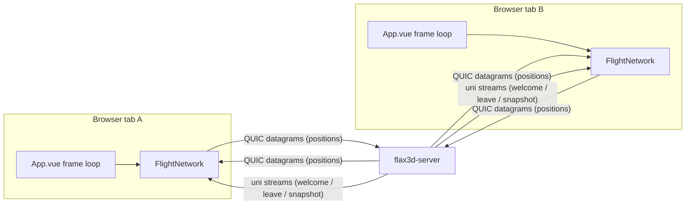
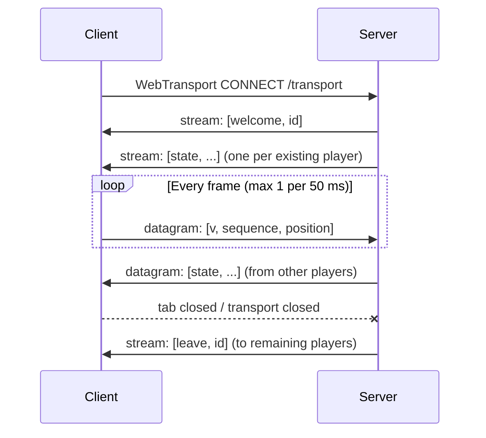

# Client–Server Behaviour

This document describes the multiplayer wire protocol and the runtime behaviour of the WebTransport
link between the Vue client (`src/network.ts`) and the Rust server (`server/src/main.rs`).

Related reading: [README.md](README.md) covers local and VPS deployment.

## Topology



The server owns a single shared `Room`. It relays position updates between clients and never runs
physics or scoring itself — the first release is visual shared flight only.

## Connection lifecycle



1. The client opens a WebTransport session to `/transport`.
2. The server assigns a monotonically increasing `id` (starting at 1) and sends a `welcome` message
   on its own unidirectional stream.
3. The server sends a snapshot of every existing player as individual `state` messages on separate
   unidirectional streams.
4. The client begins sending position updates as datagrams and consuming relayed datagrams.
5. When the session ends, the server's `PlayerGuard` drops, removes the player from the room, and
   broadcasts `leave` to everyone else on a unidirectional stream.

If the room already holds `MAX_PLAYERS` (32), the connection is rejected before any stream is opened.

## Endpoints and certificate trust

| Mode | WebTransport URL | Certificate trust |
| --- | --- | --- |
| Dev (`vite dev`) | `https://127.0.0.1:8698/transport` | Self-signed cert; client fetches its SHA-256 via Vite proxy `/local-certificate-hash` → `http://127.0.0.1:8699/certificate-hash` and passes `serverCertificateHashes` |
| Production | `https://<hostname>:<port or 443>/transport` | Real ACME certificate issued by the server (Certon HTTP-01) |

In dev the server binds TCP/UDP 8698 for WebTransport and TCP 8699 for the certificate-hash
metadata. In production, TCP 80 handles the ACME challenge, TCP 443 serves the site, and UDP 443
carries HTTP/3 WebTransport.

## Wire format

Messages are **MessagePack arrays** (`@msgpack/msgpack` in the browser, `rmp-serde` on the server).
Arrays are positional, so field names never travel on the wire. Every float is scaled to a
fixed-point integer first, because MessagePack encodes a JS number as 8 bytes but a small integer as
1–5. The units table below is the contract between the two implementations; both sides must agree
exactly.

| Value | Unit | Scale | Wire type | Range |
| --- | --- | --- | --- | --- |
| `x`, `y`, `z` | centimetres | ×100 | `i32` | `±45000` |
| `yaw` | milliradians, wrapped to `[-π, π)` | ×1000 | `i16` | `±4000` |
| `bank` | milliradians | ×1000 | `i16` | `±1000` |
| `speed` | centimetres/second | ×100 | `u16` | `≤10000` |
| `spread` | milli-units | ×1000 | `u16` | `0..=1000` |
| `flap`, `flying`, `fire` | boolean | — | bool | — |
| `wingLeft`, `wingRight` | milliradians | ×1000 | `i16` | `±2000` |

### Client → server: `Update`

```text
[ 4, sequence, [ x, y, z, yaw, bank, speed, flying, spread, flap, wingLeft, wingRight, fire ] ]
```

- `sequence` is a per-connection counter incremented on every send.
- `yaw` is wrapped with `atan2(sin, cos)` before scaling. The local yaw grows without bound, so
  wrapping keeps the `i16` field precise and makes remote interpolation a plain shortest-arc lerp.
- `wingLeft` / `wingRight` are the per-side shoulder angles taken from the same values the local
  avatar renders with (pose-driven when the camera is tracking, otherwise the flap beat). Sending
  both lets remote players see asymmetric flapping as well as spread.
- `fire` is true while the sender holds the trigger. It is **not** bullet state: peers only use it to
  play a cosmetic shot from their own copy of the sender's gun, so bullets, drop and impacts stay
  local and nothing extra is simulated on the server. A tap lasts a single frame but updates are
  unreliable and only sent at 20 Hz, so the client repeats the flag over the next three updates
  (~100 ms, just under the 110 ms fire interval) — enough to survive a lost datagram while still
  producing exactly one shot. Holding the trigger keeps it true and each client throttles its own
  shots with the fire interval.
- Sent via `encodeUpdate` at most once every 50 ms (20 Hz).

### Server → client: `Event`

Tagged by a leading integer:

```text
welcome: [ 0, id ]
state:   [ 1, id, sequence, [ ...same 12 position values... ] ]
leave:   [ 2, id ]
```

## Transport mapping

| Message | Transport | Reliability |
| --- | --- | --- |
| `Update` (positions) | QUIC datagram | Unreliable, unordered |
| `state` relay (positions) | QUIC datagram | Unreliable, unordered |
| `welcome` | Unidirectional stream | Reliable, ordered |
| `state` snapshot on join | Unidirectional stream | Reliable, ordered |
| `leave` | Unidirectional stream | Reliable, ordered |

Datagrams are QUIC DATAGRAM frames (RFC 9221) over UDP, not raw UDP: they are encrypted and
congestion-controlled but are not retransmitted. Lifecycle messages that must not be lost use
reliable streams instead. Well-known ports: QUIC runs on UDP 443 in production.

## Validation and limits

Server-side (`Position::valid`, `MAX_PACKET`):

- Rejects packets larger than `MAX_PACKET` (512 bytes). A real update encodes to about 34 bytes.
- Rejects datagrams that fail to deserialize as `Update`.
- Requires `v == 4` (see the migration note below).
- Requires every fixed-point field to be within the range in the units table.
- Rate limits accepted input to at most one update per 25 ms per connection.
- Rejects non-monotonic `sequence` values per player.

Client-side (`handleEvent`, `decodePosition`, `receiveReliable`):

- Ignores unparsable MessagePack, non-array messages, and arrays of the wrong length.
- Ignores events whose `id` is not a safe integer, and its own `id`.
- Ignores a position array that is not exactly 12 entries or holds a non-numeric value.
- Ignores reliable stream frames larger than 512 bytes.
- Drops stale/duplicate `sequence` values.

## Migration note

Version 3 replaced the earlier JSON encoding outright; there is no dual-dialect path. Version 4
appended the `fire` flag to the position array, so a v3 client encodes 11 fields while a v4 server
expects 12. Version mismatches and short arrays are dropped by validation, which makes an out-of-date
tab fall back to `SOLO` and retry. Deploy the server and the frontend together, then **hard-refresh
every tab that is already open**.

## Tests

The wire format is pinned from both sides:

- `decodes_a_client_update_fixture` in `server/src/main.rs` decodes a byte-exact fixture.
- `encodes a position update as a fixed-point MessagePack array` in `src/__tests__/network.spec.ts`
  asserts the client encoder produces that same fixture.

If either test fails, the two languages have drifted apart. Changing the units table or the field
order means updating both fixtures together.

## Interpolation and expiry

Remote players are rendered smoothly rather than snapping to each received frame:

- Each player keeps the previous and current snapshot plus a receive timestamp.
- `remotes(now)` interpolates position, `bank`, `wingLeft`, and `wingRight` between the two
  snapshots, and yaw along the shortest arc.
- `fire` is a level flag rather than an interpolated value: `remotes(now)` passes through the newest
  snapshot's value and the renderer holds it until the next packet replaces it.
- The interpolation window is the measured arrival gap between the last two packets, clamped to
  40–300 ms (100 ms until a second packet arrives). This keeps motion continuous at any send rate
  without hard-coding one.
- The renderer additionally eases the shoulder and elbow of each wing toward its interpolated angle,
  so a 20 Hz stream still looks like continuous wingbeats.
- A player with no update for 3 seconds is removed from the local map.

## Update rate and bandwidth

Positions are sent at 20 Hz and interpolated, which is a good balance for a game of this speed:

- A full `Update` is about 34 bytes, plus roughly 50 bytes of IPv6/UDP/QUIC framing per datagram.
  At 20 Hz that is under 2 KB/s per client — comfortably inside typical MTU, so a datagram is never
  fragmented and a lost one costs very little.
- Server egress scales as `players × (players − 1) × rate × size`. At the 32-player cap and 20 Hz
  that is about 1.7 MB/s, roughly half the JSON cost.
- Wingbeats need the higher end of the range: at 20 Hz a ~2 Hz flap is sampled ten times per cycle,
  which reads as smooth. Going past 20–30 Hz buys little for this motion while the quadratic fan-out
  cost keeps growing.
- 10 Hz + interpolation is a legitimate floor if bandwidth or player count becomes the constraint;
  the measured-window interpolation adapts automatically.

Bumping the rate means keeping three numbers in sync: `SEND_INTERVAL_MS` in `src/network.ts`, the
`25 ms` throttle in `server/src/main.rs`, and `MAX_PACKET` if the payload grows.

## Disconnection and reconnection

- The client observes `connection.closed`; any close or write failure calls `disconnect()`, clears
  players, and reports `SOLO`.
- `App.vue` reconnects after 3 seconds whenever the status is `SOLO` while the game is running
  (single pending timer, no overlap).
- The page stays playable with no server: pose detection and webcam video never leave the device.

## Server room model

- `Room` holds `next_id`, a `Mutex<HashMap<u64, Player>>`, and a `broadcast::Sender<Event>`
  (capacity 256).
- Each connection subscribes to the broadcast channel and forwards `state` events from other
  players as datagrams, while `welcome` / `leave` use reliable streams.
- Lagged broadcast receivers skip missed events rather than terminating.
- A `PlayerGuard` guarantees cleanup and `leave` broadcast even on abrupt disconnects.

## Source map

| Concern | Location |
| --- | --- |
| Client transport, wire codec, interpolation | `src/network.ts` |
| Client usage in frame loop and reconnect timer | `src/App.vue` |
| Remote avatar, wing and shot rendering | `src/scene.ts` |
| Wire-format fixture (client side) | `src/__tests__/network.spec.ts` |
| Wire-format fixture (server side) | `server/src/main.rs` |
| Dev certificate-hash proxy | `vite.config.ts` |
| Server room, protocol, validation, relay | `server/src/main.rs` |
